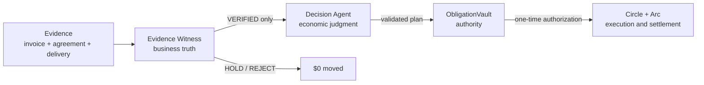

# Euthyna

> **Before an agent can pay, Euthyna proves there is something to pay for.**

Euthyna is a proof-of-obligation payment agent. A deterministic Evidence
Witness establishes business truth; an Agent decides timing and priority; a
versioned vault contract holds payment authority; Circle and Arc execute the
authorized settlement.

[Open the live reviewer app](https://karagozemin.github.io/Euthyna/) ·
[Start the no-login demo](https://karagozemin.github.io/Euthyna/demo/) ·
[Verified Arc vault](https://explorer.testnet.arc.io/address/0x61322f6e21ec822cb220b145fb9184265a580b12) ·
[First Arc settlement](https://explorer.testnet.arc.io/tx/0xb386d3041613b028bc6aa88518e8a010b01b1c0eb59aca632da4eefc4fac6b42)

> The public settlement and every bundled reviewer scenario are labelled
> **TEST — Arc Testnet**. They prove system behavior; they are not presented as
> customer traction. REAL pilot metrics currently remain zero.

## The 90-second judge path

1. Read the thesis and role separation at `/demo`.
2. Run **Valid obligation** and open its real Arc Testnet receipt.
3. Run **Constrained-cash prioritization** to see the Agent preserve reserve.
4. Run **Duplicate obligation** and **Payout destination changed**; both move
   `$0` and stop before signing.
5. Open **Metrics** to see TEST and REAL activity separated explicitly.

No login, wallet or setup is required.

## Architecture



**Evidence → Witness → Agent Decision → Authorization → Arc Settlement**

- **Witness = business truth.** It checks the underlying obligation and never
  decides whether paying now is economically wise.
- **Agent = economic judgment.** It prioritizes only VERIFIED obligations and
  cannot alter their amount, payee or currency.
- **Contract = authority.** It enforces the exact attestation, versions, cap,
  destination and replay boundaries.
- **Arc / Circle = execution and settlement.** Circle submits the prepared
  contract call; reconciliation proves the exact onchain outcome.

## Four reviewer scenarios

| Scenario | Business question | Expected result | Money moved |
| --- | --- | --- | ---: |
| A — Valid obligation | Do invoice, agreement and delivery agree? | `VERIFIED → PAY_NOW → SETTLED` | `0.001 USDC` on Arc Testnet |
| B — Agentic prioritization | What should be paid when liquidity is constrained? | `1 PAY_NOW · 2 SCHEDULE` while reserve remains intact | `$0` decision preview |
| C — Duplicate obligation | Is a reformatted invoice the same underlying debt? | `REJECTED · DUPLICATE_OBLIGATION` | `$0` |
| D — Destination change | Did a legitimate invoice request a new payout address? | `HOLD · PAYOUT_DESTINATION_CHANGED` | `$0` |

Every detail view exposes the obligation, redacted evidence metadata, W01–W10,
Agent rationale, authorization boundary, settlement state and audit receipt.
HOLD and REJECT cases are first-class outcomes, not hidden exceptions.

## The problem

Wallet limits and spending budgets answer **how much** an agent may transfer.
They do not prove **why** a payment exists, whether delivery occurred, whether
an invoice is a duplicate, or whether a payout address was quietly replaced.

An autonomous payment system needs both economic judgment and business truth,
without allowing either one to become unilateral payment authority. Euthyna
keeps those responsibilities separate and produces a reviewer-readable trail
from evidence to settlement.

## Core components

### Evidence Witness

The Witness deterministically evaluates ten checks:

- required evidence classes;
- vendor identity;
- amount and currency agreement;
- agreement validity;
- delivery acceptance;
- semantic duplicate detection;
- verified payout destination;
- prior settlement;
- evidence freshness and versions;
- resolved, unambiguous payment fields.

It emits `VERIFIED`, `HOLD` or `REJECT` with an evidence root, reason code,
expected/observed values and required human action where relevant.

### Decision Agent

The Agent sees only VERIFIED obligations. It ranks business priorities such as
due dates, vendor criticality, discounts, expected inflows and minimum reserve.
A deterministic validator rejects any attempt to change amount, payee,
currency, approval boundary or reserve policy.

### ObligationVault

The Arc contract binds an authorization to the business, obligation, operation,
vendor version, payee, token, amount, evidence root, decision commitment,
policy/rules/witness versions, expiry, chain and vault. Obligation and operation
IDs are one-time replay keys.

### Arc and Circle

Circle's managed contract-execution path submits only the prepared vault call.
Arc Testnet executes it against the official USDC contract. Reconciliation
matches the emitted operation, vendor, payee, amount and cryptographic
commitments before producing the final receipt.

## Public Arc Testnet proof

- Vault: `0x61322f6e21ec822cb220b145fb9184265a580b12`
- Settlement: `0xb386d3041613b028bc6aa88518e8a010b01b1c0eb59aca632da4eefc4fac6b42`
- Settlement block: `64819572`
- Amount: `0.001 USDC`
- Result: `RECONCILED`
- Crash/retry duplicate amount: `0`

The reproducible flow and complete public hashes are in
[`docs/FIRST_ARC_SETTLEMENT.md`](docs/FIRST_ARC_SETTLEMENT.md) and
[`artifacts/first-arc-settlement.json`](artifacts/first-arc-settlement.json).
Private documents, API credentials, entity secrets and signing keys are never
part of the public artifact or reviewer bundle.

## Security properties

- Raw model output is never an authorization input.
- HOLD and REJECT obligations never reach the signing path.
- The Witness cannot make economic scheduling decisions.
- The Agent cannot change verified payment facts.
- Destination rotation invalidates stale authorizations through vendor version.
- Witness, rules and policy rotations invalidate stale authorizations.
- Obligation and operation replay protections are enforced onchain.
- Crash-safe reconciliation finds the existing settlement instead of paying
  twice.
- Production witness signing is an interface boundary; raw private keys fail
  closed in production.
- Public reviewer data is classified `TEST` or `REAL`; source evidence stays
  private.

## Metrics and traction

The reviewer metrics view follows the Tameion RFB language: obligations
processed, payment volume, duplicates caught, autonomous settlements, decisions
versus escalations, human agreement rate, HOLD events, destination changes and
settlement success rate.

Synthetic and adversarial fixtures appear only under **TEST**. There are
currently no claimed REAL pilot obligations or payment volume. A pilot record
can expose redacted business/vendor/obligation metadata, amount, evidence types,
verdict, decision and settlement result without exposing private documents.

The operator-assisted REAL pilot path is documented in
[`docs/REAL_PILOT_RUNBOOK.md`](docs/REAL_PILOT_RUNBOOK.md). Private documents and
consent records stay under ignored `.euthyna/pilots/`; a strict publisher emits
only [`artifacts/pilots/public-index.json`](artifacts/pilots/public-index.json).
The committed index currently reports zero REAL businesses and obligations.

The same private workflow is available as a local operator UI:

```sh
pnpm pilot:ui
```

Open `http://localhost:5173/pilot` (or the next port printed by Vite). The API
binds only to `127.0.0.1:8787`; uploads are written with private permissions and
evaluated by the unchanged W01–W10 and bounded Agent path. The public Pages
deployment can display the route but intentionally cannot accept documents.
Settlement eligibility is shown truthfully; no transaction is broadcast unless
a business-bound vault and the separate operator executor are configured.

## Tests

The repository exercises the complete trust path:

- canonical evidence and decision commitments;
- W01–W10, including semantic duplicates and payout changes;
- bounded Agent planning and deterministic validation;
- Circle managed transaction preparation and crash reconciliation;
- immutable receipts and audit chaining;
- ObligationVault replay, version, cap, expiry and signature boundaries;
- reviewer scenario invariants pinned to the committed Arc proof artifact.

```sh
pnpm typecheck
pnpm test
pnpm build
```

## Local development

Requirements: Node.js 20+, pnpm 8.15 and Foundry for contract tests.

```sh
pnpm install
pnpm --filter @euthyna/web dev
```

Open `http://localhost:5173/demo`. The browser demo is deterministic, needs no
credentials and never broadcasts a transaction. The live Arc fixture is
read-only public proof.

For the hardened Arc Testnet deployment, preflight, Circle smoke, intentional
crash and retry workflow, follow
[`docs/FIRST_ARC_SETTLEMENT.md`](docs/FIRST_ARC_SETTLEMENT.md).
