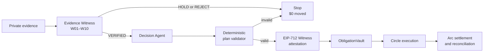

<p align="center">
  
</p>

<h1 align="center">Euthyna</h1>

<p align="center">
  <strong>Proof-of-obligation infrastructure for agentic payments.</strong><br>
  Before an agent can pay, Euthyna proves there is something to pay for.
</p>

<p align="center">
  <a href="https://karagozemin.github.io/Euthyna/">Reviewer app</a> ·
  <a href="https://karagozemin.github.io/Euthyna/demo/">No-login demo</a> ·
  <a href="https://explorer.testnet.arc.io/address/0x61322f6e21ec822cb220b145fb9184265a580b12">Verified Arc vault</a> ·
  <a href="https://explorer.testnet.arc.io/tx/0xb386d3041613b028bc6aa88518e8a010b01b1c0eb59aca632da4eefc4fac6b42">Settlement proof</a>
</p>

> [!IMPORTANT]
> The public settlement and bundled reviewer scenarios are labelled
> **TEST — Arc Testnet**. They prove system behavior, not customer traction.
> The committed REAL pilot index currently reports zero businesses, zero
> obligations, and zero payment volume.

## What Euthyna does

Wallet limits answer _how much_ an agent may transfer. They do not establish
whether an invoice is legitimate, delivery occurred, the obligation was already
paid, or a payout destination was silently replaced.

Euthyna separates those questions into independent control layers:

1. An **Evidence Witness** deterministically establishes business truth.
2. A **Decision Agent** chooses timing and priority only for verified obligations.
3. A **plan validator** independently rejects mutated or policy-breaking output.
4. A **Witness attestation** binds the exact payment meaning and versioned context.
5. **ObligationVault** is the final authority that can release funds once.
6. **Circle and Arc** execute and reconcile the exact authorized call.

The result is a reviewable trail from private evidence to an onchain settlement,
without giving a model unilateral payment authority.

## System at a glance



**Evidence → Witness → Agent → Validation → Authorization → Settlement**

For component boundaries, runtime modes, data flow, trust assumptions, contract
checks, deployment topology, and known limitations, read the
**[Architecture Guide](docs/ARCHITECTURE.md)**.

## The trust split

| Layer | Owns | Must never do |
| --- | --- | --- |
| Evidence normalization | Typed fields, provenance, canonical hashes | Declare an obligation valid |
| Evidence Witness | W01–W10, `VERIFIED` / `HOLD` / `REJECT`, evidence root | Choose payment timing or move funds |
| Decision Agent | Priority, timing, reserve-aware recommendation | Change verified amount, token, or payee |
| Plan validator | Mechanical policy and invariant enforcement | Invent evidence or sign authorization |
| Witness signer | Short-lived EIP-712 authorization | Sign a failed Witness or invalid plan |
| ObligationVault | Exact authorization enforcement and token release | Interpret invoices or trust model prose |
| Circle / Arc executor | Submit, finalize, and reconcile the prepared call | Replace the attested transaction meaning |

## What is implemented

- Canonical TypeScript domain schemas and integer-only money handling.
- Deterministic evidence fingerprints, roots, and ten Witness checks.
- Versioned vendor destinations with destination-change HOLD behavior.
- A bounded reserve-aware Decision Agent and independent plan validator.
- EIP-712 Witness authorizations with explicit chain and vault binding.
- A Solidity vault with business, vendor, policy, signer, rules, cap, approval,
  expiry, token, destination, and replay enforcement.
- Circle developer-controlled wallet execution on Arc and event-level
  reconciliation.
- Canonical pre-authorization commitments and final decision receipts.
- A reviewer application with four deterministic adversarial scenarios.
- A REAL pilot intake/evaluation path that never broadcasts settlement.
- Drizzle/PostgreSQL schema definitions and an in-memory transactional
  repository used by the current orchestration tests.

The generic production API service implementation, durable pilot object storage,
API authentication, rate limiting, and worker runtime are not complete. See
[Current limitations](#current-limitations).

## Reviewer scenarios

| Scenario | Question | Expected result | Money moved |
| --- | --- | --- | ---: |
| Valid obligation | Do invoice, agreement, delivery, and destination agree? | `VERIFIED → PAY_NOW → SETTLED` | `0.001 USDC` on Arc Testnet |
| Constrained cash | What should be paid without breaching reserve? | `1 PAY_NOW · 2 SCHEDULE` | `$0` decision preview |
| Duplicate obligation | Is a reformatted invoice the same debt? | `REJECT · DUPLICATE_OBLIGATION` | `$0` |
| Destination change | Did a valid invoice request a new address? | `HOLD · DESTINATION_CHANGED` | `$0` |

Recommended reviewer path:

1. Open `/demo` and read the role separation.
2. Run **Valid obligation** and inspect the Arc receipt.
3. Run **Constrained-cash prioritization** and inspect the reserve decision.
4. Run the duplicate and destination-change cases; both stop before signing.
5. Open `/metrics` and verify that TEST and REAL activity remain separated.

No login, wallet, or local setup is required for the public demo.

## Public Arc Testnet proof

| Field | Value |
| --- | --- |
| Network | Arc Testnet (`5042002`) |
| Vault | [`0x6132…b12`](https://explorer.testnet.arc.io/address/0x61322f6e21ec822cb220b145fb9184265a580b12) |
| Settlement | [`0xb386…b42`](https://explorer.testnet.arc.io/tx/0xb386d3041613b028bc6aa88518e8a010b01b1c0eb59aca632da4eefc4fac6b42) |
| Block | `64819572` |
| Amount | `0.001 USDC` |
| Result | `RECONCILED` |
| Duplicate amount after crash/retry | `0` |

The reproducible sequence and public hashes are documented in
[First Arc Settlement](docs/FIRST_ARC_SETTLEMENT.md). The machine-readable proof
is stored in [`artifacts/first-arc-settlement.json`](artifacts/first-arc-settlement.json).

## Quick start

### Requirements

- Node.js 20 or newer
- pnpm 8.15.0 through Corepack
- Foundry for Solidity build and contract tests
- Arc Foundry only for Arc-specific deployment and simulation

```bash
corepack enable
pnpm install --frozen-lockfile
```

### Run the reviewer application

```bash
pnpm --filter @euthyna/web dev
```

Open `http://localhost:5173/demo`.

### Run the private pilot locally

```bash
pnpm pilot:ui
```

This starts the Vite application and the private pilot API together. Open
`http://localhost:5173/pilot`; Vite proxies `/pilot-api/*` to
`127.0.0.1:8787`.

The pilot path:

- accepts operator-confirmed evidence and consent;
- stores private records below the gitignored `.euthyna/pilots/` directory;
- executes the same Witness and bounded Agent logic;
- reports settlement eligibility truthfully; and
- never signs or broadcasts a transaction.

See the [REAL Pilot Runbook](docs/REAL_PILOT_RUNBOOK.md) before handling any
non-synthetic material.

## Test and build

```bash
# Complete TypeScript + Solidity suite
pnpm typecheck
pnpm test
pnpm build

# Focused packages
pnpm --filter @euthyna/web test
pnpm --filter @euthyna/api... build
forge test --root contracts
```

The suite covers canonicalization, W01–W10, duplicate and destination attacks,
plan validation, authorization boundaries, vault replay/version/cap/expiry
checks, Circle identity checks, crash-safe reconciliation, audit chaining, and
reviewer fixture invariants.

## Deployment

### Reviewer and pilot frontend — Vercel

The repository-root [`vercel.json`](vercel.json) contains the production build,
SPA fallback, and pilot proxy configuration.

| Setting | Value |
| --- | --- |
| Root directory | repository root |
| Framework preset | Other |
| Install command | `pnpm install --frozen-lockfile` |
| Build command | `pnpm --filter @euthyna/web build` |
| Output directory | `apps/web/dist` |
| Node.js | 22.x |
| Required Vercel environment variables | none |

In production, Vercel proxies `/pilot-api/*` to the configured Render service.
Local Vite development keeps the same browser path and proxies it to localhost.

### Pilot evaluation API — Render

```text
Build:  bash scripts/render-build.sh
Start:  node apps/api/dist/pilot-server.js
Health: /health
```

Render supplies `PORT`; the server then listens on `0.0.0.0`. Without `PORT`, it
fails closed to `127.0.0.1:8787` for local operator use.

> [!WARNING]
> The current hosted pilot service has no user authentication, authorization,
> rate limiting, malware scanning, or durable private object store. Render local
> disk may be ephemeral. Use synthetic or explicitly controlled pilot data only;
> do not treat this deployment as production custody for sensitive documents.

### Arc settlement runner

The onchain settlement workflow is deliberately separate from the hosted pilot
API. Copy `.env.example` to an ignored local environment file and follow
[First Arc Settlement](docs/FIRST_ARC_SETTLEMENT.md). Browser and public API
deployments must never receive Circle credentials, witness keys, or owner keys.

## Repository map

```text
apps/
├── api/          API boundary, private pilot server, Arc settlement runner
├── web/          React reviewer, metrics, scenarios, and pilot UI
└── worker/       Planned background-runtime boundary
packages/
├── domain/       Canonical Zod schemas and shared types
├── evidence/     Canonical JSON, fingerprints, evidence roots
├── witness/      W01–W10 and Witness authorization
├── planner/      Bounded Agent and deterministic validator
├── chain/        Arc config, simulation, Circle execution, reconciliation
├── receipts/     Decision commitment and receipt hashing
└── db/           Drizzle schema, migration, audit, in-memory repository
contracts/        ObligationVault, deployment script, Foundry tests
deployments/      Public deployment metadata
artifacts/        Public-safe proof and pilot projection artifacts
docs/             Architecture, security, evidence, deployment, runbooks
```

## Core invariants

1. Only `VERIFIED` obligations can enter an executable payment plan.
2. Agent output is untrusted until deterministic validation succeeds.
3. The Agent cannot change verified amount, payee, currency, or token decimals.
4. Ambiguous or incomplete evidence fails closed to HOLD or REJECT.
5. Destination, policy, signer, or rules changes invalidate stale authorization.
6. Authorization binds the business, obligation, operation, vendor, payee,
   token, amount, evidence, decision, versions, expiry, chain, and vault.
7. Obligation and operation IDs are independent one-time replay keys onchain.
8. Chain state and the emitted settlement event are authoritative on retry.
9. Monetary values cross service boundaries as integer base-unit strings;
   floating-point money is forbidden.
10. TEST and REAL records remain explicitly classified and separately measured.

## Documentation

| Document | Purpose |
| --- | --- |
| **[Architecture Guide](docs/ARCHITECTURE.md)** | System boundaries, flows, deployment, trust, data, and limitations |
| [Evidence Model](docs/EVIDENCE_MODEL.md) | Evidence authority, provenance, canonical roots, W01–W10 |
| [Witness Authorization](docs/AUTHORIZATION.md) | EIP-712 payload and authorization lifecycle |
| [Threat Model](docs/THREAT_MODEL.md) | Threats, controls, and residual risk |
| [First Arc Settlement](docs/FIRST_ARC_SETTLEMENT.md) | Reproducible deploy, preflight, broadcast, crash, retry, proof |
| [REAL Pilot Runbook](docs/REAL_PILOT_RUNBOOK.md) | Private operator workflow, consent, redaction, publication |
| [Demo Scenarios](docs/DEMO.md) | Expected reviewer scenarios and outcomes |
| [Implementation Status](docs/IMPLEMENTATION_STATUS.md) | PRD mapping and implementation history |

## Current limitations

- The hosted pilot endpoint is an evaluation surface, not a hardened customer
  portal, and it does not broadcast settlement.
- Pilot files use local filesystem storage; hosted durability is not guaranteed.
- The generic API has route and service boundaries, but no complete production
  service composition or authentication middleware.
- PostgreSQL schemas and migrations exist; the current repository implementation
  exercised by tests is in-memory.
- The worker package is a documented boundary, not an implemented runtime.
- The included Decision Agent is deterministic and bounded. A model-backed Agent
  must emit the same schema and pass the same validator.
- Production Witness custody requires a managed `WitnessTypedDataSigner`;
  local raw-key signing is rejected when `NODE_ENV=production`.
- Arc proof is testnet evidence. Mainnet deployment and production operations are
  outside the claims of this repository.

## Security

Do not commit private evidence, `.env` files, Circle secrets, entity secrets,
owner keys, witness keys, or recovery material. If you find a vulnerability,
report it privately to the repository owner instead of opening a public issue
containing exploit details or sensitive data.
