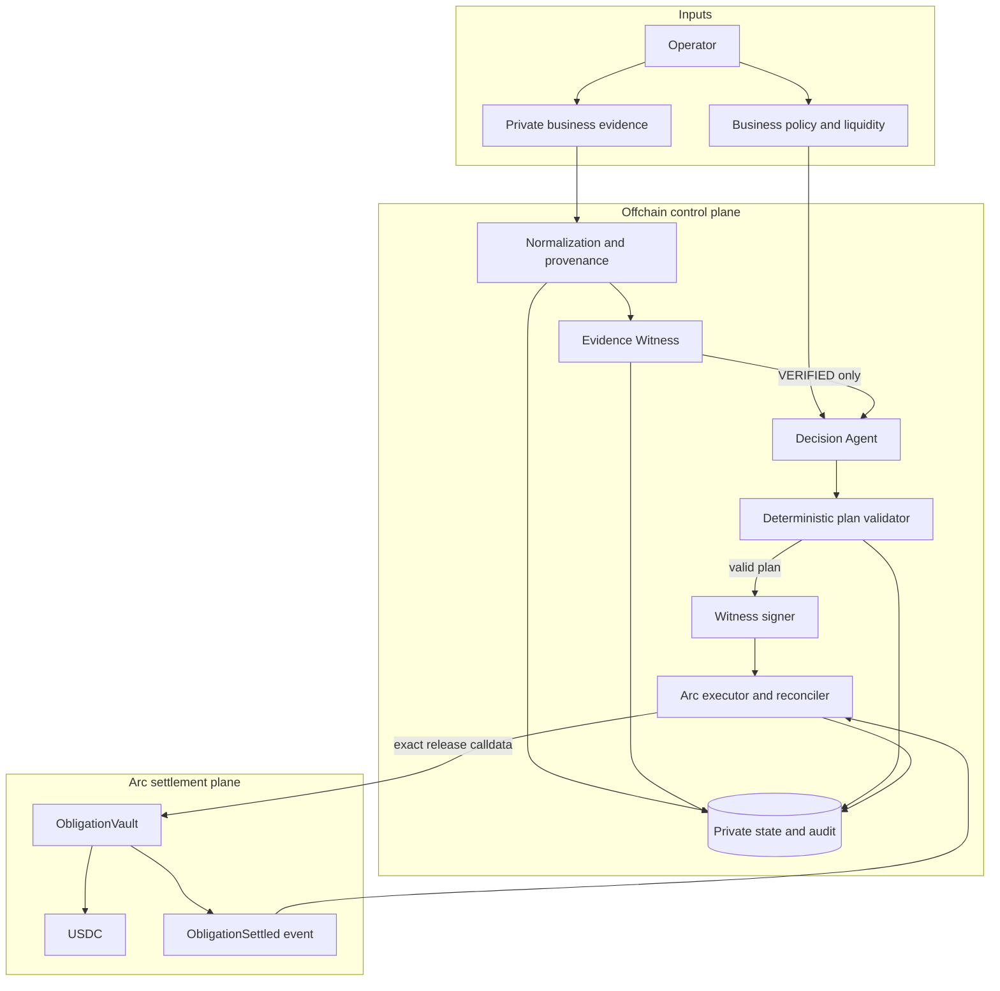
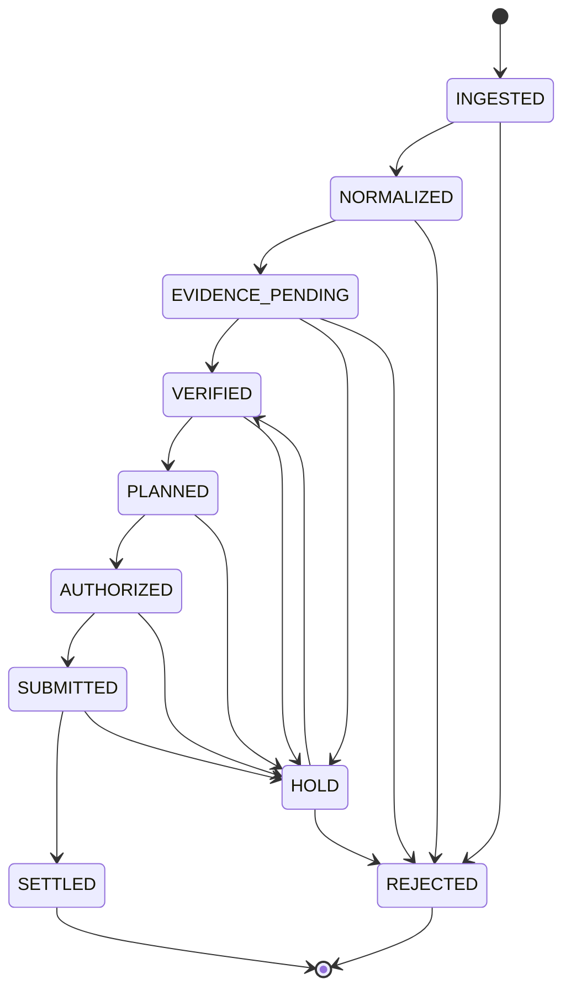
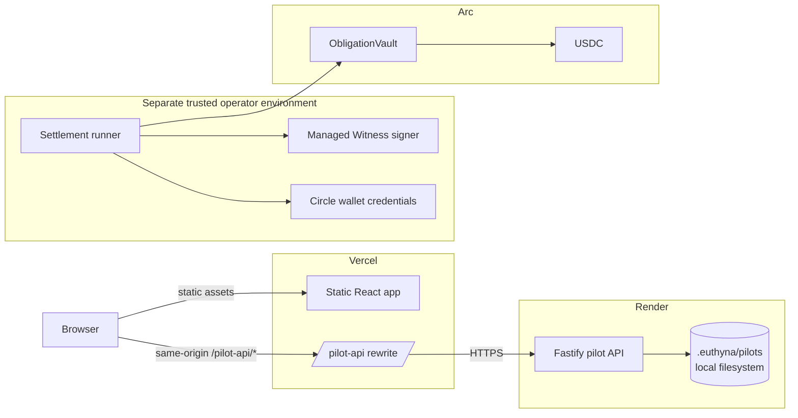

# Euthyna Architecture

This document describes the architecture implemented in this repository: its
runtime modes, component boundaries, trust model, state transitions,
cryptographic commitments, deployment topology, and known gaps.

It is descriptive, not aspirational. Where the repository contains only a
schema, interface, or planned boundary, that status is stated explicitly.

## 1. Architectural thesis

Euthyna is a proof-of-obligation system for agentic payments. Its central design
decision is that no single probabilistic or operational component is allowed to
both establish business truth and move money.

The system separates four kinds of authority:

- **Evidence authority:** deterministic checks establish whether an obligation
  is sufficiently supported by evidence.
- **Economic judgment:** an Agent recommends when and how a verified obligation
  should be handled.
- **Payment authority:** a versioned EIP-712 attestation and `ObligationVault`
  enforce the exact authorized payment meaning.
- **Execution authority:** Circle submits the prepared call; Arc and the emitted
  contract event establish the final outcome.

This gives Euthyna two independent fail-closed gates before signing and a third
onchain gate before funds move.

## 2. Goals and non-goals

### Goals

- Prove that a payable business obligation exists before autonomous settlement.
- Detect missing evidence, semantic duplicates, prior settlement, stale records,
  ambiguous fields, and changed payout destinations.
- Permit economic prioritization without allowing the Agent to mutate verified
  payment facts.
- Bind offchain evidence and decisions to a short-lived onchain authorization.
- Make retries safe across request loss, process failure, and chain finality.
- Preserve a public, reviewer-readable proof without publishing raw evidence.
- Keep TEST demonstrations and REAL pilot metrics explicitly separated.

### Non-goals of the current implementation

- General-purpose invoice OCR or untrusted document extraction.
- A production customer identity and access management system.
- Durable hosted private-document custody.
- Fully autonomous mainnet operation.
- A model deciding whether evidence is true.
- A model or API server holding unilateral payment authority.

## 3. Runtime modes

The repository supports three distinct paths. They share domain logic but do not
have identical authority or privacy guarantees.

| Mode | Entry point | Data classification | Can evaluate evidence? | Can settle? | Persistence |
| --- | --- | --- | --- | --- | --- |
| Reviewer demo | `apps/web`, `/demo` | TEST | Replays committed fixtures | No; displays a prior proof | Static public bundle |
| REAL pilot evaluation | `apps/web`, `/pilot` + `pilot-server.ts` | REAL | Yes, operator-confirmed | No; eligibility only | `.euthyna/pilots/` filesystem |
| Arc settlement runner | `first-arc-settlement.ts` | TEST in committed proof | Yes | Yes, with explicit acknowledgements and credentials | Public artifact + private checkpoint |

The generic API adapter in `apps/api/src/server.ts` defines the intended full
route surface through an injected `EuthynaApiService`, but this repository does
not yet compose that interface into a production service process.

## 4. System context



The browser is never a signing boundary. Circle credentials, witness signing
material, and owner keys must remain server-side. Pilot evidence may transit the
browser during operator upload, but it must never enter the public bundle,
client telemetry, or browser persistence.

## 5. Component boundaries

| Component | Location | Responsibility | Trust level / status |
| --- | --- | --- | --- |
| Domain schemas | `packages/domain` | Canonical runtime validation and shared types | Implemented; authoritative service-boundary shapes |
| Evidence utilities | `packages/evidence` | Canonical JSON, normalization, fingerprints, evidence root | Implemented; deterministic |
| Evidence Witness | `packages/witness/verify.ts` | W01–W10 and final verdict | Implemented; sole evidence-verdict authority |
| Witness authorization | `packages/witness/authorization.ts` | Gate and sign EIP-712 attestation | Implemented interface; managed production signer pending |
| Decision Agent | `packages/planner/agent.ts` | Reserve-aware prioritization | Implemented bounded deterministic agent |
| Plan validator | `packages/planner/validator.ts` | Recompute mechanical invariants | Implemented; Agent output is untrusted input |
| Receipts | `packages/receipts` | Pre-authorization and final receipt commitments | Implemented; canonical SHA-256 commitments |
| Chain adapter | `packages/chain` | Arc config, simulation, Circle submission, reconciliation | Implemented for Arc / Arc Testnet |
| ObligationVault | `contracts/src/ObligationVault.sol` | Final payment authorization and release | Implemented and deployed on Arc Testnet |
| Data schema | `packages/db/src/schema.ts` | PostgreSQL/Drizzle relational model | Implemented schema and migration |
| Repository | `packages/db/src/repository.ts` | Transactional state transitions and audit writes | Current implementation is in-memory |
| Generic API | `apps/api/src/server.ts` | HTTP route adapter over `EuthynaApiService` | Interface/adapter implemented; production composition pending |
| Pilot API | `apps/api/src/pilot-server.ts` | REAL intake, evaluation, feedback | Implemented; no settlement broadcast |
| Reviewer web | `apps/web` | Demo, proof, metrics, pilot UI | Implemented |
| Worker | `apps/worker` | Future ingestion, scheduling, reconciliation jobs | Planned only |

### Package dependency direction

Dependencies intentionally point toward stable domain contracts:

```text
domain
├── evidence
│   ├── planner
│   ├── receipts
│   └── db
├── chain
└── witness ──> chain

api ──> domain + evidence + witness + planner + receipts + chain + db
web ──> public fixtures and HTTP pilot boundary
contracts ──> OpenZeppelin only
```

`domain` contains no infrastructure dependency. The Witness and validator are
callable without HTTP, a database, Circle, or a chain connection.

## 6. End-to-end settlement flow

```mermaid
sequenceDiagram
    autonumber
    participant O as Operator / Orchestrator
    participant W as Evidence Witness
    participant A as Decision Agent
    participant G as Plan Validator
    participant S as Witness Signer
    participant E as CircleArcExecutor
    participant C as Circle Wallet
    participant V as ObligationVault
    participant R as Arc RPC

    O->>W: Obligation + evidence + vendor state + policy
    W-->>O: W01–W10 + verdict + evidenceRoot
    alt HOLD or REJECT
        O-->>O: Persist reason and required action
        Note over O,V: Stop before planning/signing; $0 moved
    else VERIFIED
        O->>A: Verified obligation + business state
        A-->>G: Proposed payment plan
        G-->>O: valid / errors + projected balance
        alt Invalid plan
            O-->>O: Reject Agent output
        else Valid plan
            O->>S: Decision commitment + exact payment meaning
            S-->>E: EIP-712 attestation + signature
            E->>R: Reconcile obligation before submission
            alt Existing matching settlement
                R-->>E: ObligationSettled event
            else Not settled
                E->>R: Simulate exact vault call
                R-->>E: Success
                E->>C: Submit identical calldata with idempotency key
                C->>V: release(attestation, signatures)
                V->>V: Verify versions, policy, replay, signatures
                V-->>R: Transfer USDC + emit ObligationSettled
                E->>R: Wait and reconcile exact event fields
            end
            E-->>O: Settlement / receipt
        end
    end
```

The sequence has three idempotency layers:

1. Circle receives a deterministic idempotency key derived from the attestation
   hash.
2. `ObligationVault` rejects reused obligation IDs and operation IDs.
3. The executor checks chain state before submission and after any error.

## 7. Evidence model and Witness

### Evidence representation

An `EvidenceArtifact` includes:

- source channel and private URI;
- issuer and receipt time;
- raw, content, and normalized hashes;
- relevant identifiers and typed relationships;
- parser name/version and arbitrary provenance metadata;
- nullable extracted fields and per-field provenance; and
- validity and ingestion timestamps.

Extraction is untrusted. Missing or ambiguous values remain nullable and cause a
fail-closed result where the field is required.

### Deterministic checks

All checks run on every evaluation. A failure is not hidden by an aggregate
confidence score.

| Check | Question | Failure behavior |
| --- | --- | --- |
| W01 | Are required evidence classes present? | HOLD |
| W02 | Do invoice/agreement vendor identities match the business vendor? | REJECT |
| W03 | Do amount, currency, and token decimals agree within policy tolerance? | HOLD |
| W04 | Is the referenced agreement active on the evaluation date? | HOLD |
| W05 | Is delivery or service acceptance established? | HOLD |
| W06 | Is this obligation new rather than exact, semantic, or near duplicate? | HOLD or REJECT |
| W07 | Does the requested destination match the current verified vendor version? | HOLD |
| W08 | Has this obligation already settled? | REJECT |
| W09 | Are evidence timestamps and versions fresh? | HOLD |
| W10 | Are required payment fields resolved and unambiguous? | HOLD |

When several checks fail, `REJECT` deterministically takes precedence over
`HOLD`; order within a disposition follows W01 through W10.

### Evidence root

The evidence root commits to the sorted artifact set and the deterministic check
results. It covers artifact IDs and types, issuers, receipt time, raw/content/
normalized hashes, source channel, relevant identifiers, relationships,
provenance metadata, parser identity/version, and every check's expected and
observed values. Raw source bytes and extracted field values remain offchain;
their meaning is committed through normalized hashes and check observations.

## 8. Planning and deterministic validation

The current `BoundedDecisionAgent` ranks only `VERIFIED` obligations using due
date, vendor criticality, late fees, early-payment discount, reserve, approval
threshold, and sufficiently confident expected inflows.

Possible actions are `PAY_NOW`, `SCHEDULE`, `PARTIAL_PAY`, `ESCALATE`, and
`NO_ACTION`. The current bounded agent emits `PAY_NOW`, `SCHEDULE`, or
`ESCALATE`; the shared schema supports the larger action set.

The validator independently checks:

- the obligation exists and is `VERIFIED`;
- one decision exists per obligation;
- exact amount, or a permitted valid partial amount;
- unchanged payee, currency, and token decimals;
- valid schedule semantics;
- autonomous approval threshold or explicit human approval; and
- post-payment balance at or above the reserve floor.

A future model-backed Agent must implement the same `DecisionAgent` interface,
emit the same schema, and pass the same validator. Model confidence cannot
override a validation error.

## 9. Commitments and authorization

Euthyna uses separate commitments for separate lifecycle moments.

| Commitment | Algorithm | Created | Covers | Deliberately excludes |
| --- | --- | --- | --- | --- |
| Artifact hashes | SHA-256-tagged | Intake | Raw and normalized evidence representations | Secrets outside artifact data |
| Obligation fingerprint | SHA-256 over canonical JSON | Verification | Business/vendor/invoice/date/amount/currency identity | Execution state |
| Evidence root | SHA-256 over canonical JSON | Witness | Evidence set and W01–W10 results | Raw files |
| Decision commitment | SHA-256 over canonical JSON | Before signing | Classification, Agent, Witness, exact payment, versions, chain/vault context | Signature, settlement, final receipt hash |
| Witness attestation hash | EIP-712 / Keccak-256 | Authorization | Exact onchain release meaning | Final chain result |
| Final receipt hash | SHA-256 over canonical JSON | After reconciliation | Witness, decision, authorization, settlement, human action | Nothing outside defined receipt schema |

The pre-authorization commitment excludes the signature and final settlement to
avoid a circular hash dependency. The final receipt binds the completed result
after reconciliation.

### EIP-712 attestation

The attestation binds:

```text
obligationId          operationId
businessIdHash        vendorIdHash
payee                 token
amount                evidenceRoot
decisionCommitmentHash
vendorVersion         policyVersion
witnessVersion        rulesVersion
validUntil            chainId
verifyingContract
```

`WitnessAuthorizationService` refuses to sign unless the Witness verdict is
`VERIFIED`, plan validation succeeded, amount is positive, and expiry is in the
future. The local raw-key signer throws when `NODE_ENV=production`; production
requires a separate managed `WitnessTypedDataSigner`.

## 10. ObligationVault authority

`ObligationVault` does not parse documents or evaluate Agent rationale. It
enforces the exact typed authorization against current owner policy.

Before releasing USDC, the contract checks:

- the obligation and operation replay keys are unused;
- authorization is not expired;
- chain ID and verifying contract match runtime context;
- business hash matches the immutable vault business binding;
- policy, vendor, witness, and rules versions are current;
- the vendor is active and the payee matches its current payout address;
- the token is the immutable settlement token;
- amount is positive and does not exceed the per-payment cap;
- all commitment fields are non-zero;
- the Witness signature recovers to the configured signer; and
- payments above the approval threshold include a valid, unexpired owner
  approval over the attestation hash.

Effects mark both replay keys before the ERC-20 transfer. The contract uses
OpenZeppelin `SafeERC20`, `ReentrancyGuard`, `Pausable`, `Ownable`, `ECDSA`, and
`EIP712`.

Policy, signer, vendor destination, and rules rotations increment versions so
old authorizations fail without maintaining an offchain revocation list.

## 11. Execution and reconciliation

`CircleArcExecutor` treats the attested call as immutable:

1. Validate Arc configuration and official USDC address/units.
2. Query chain state for a prior settlement.
3. Verify the configured Circle wallet identity.
4. Encode the exact `release` calldata.
5. Simulate the call through Arc RPC.
6. Submit through Circle with an attestation-derived idempotency key.
7. Wait for the Arc receipt.
8. Read the `ObligationSettled` event from the vault deployment block.
9. Compare operation, vendor, payee, amount, evidence root, decision commitment,
   and attestation hash with the submitted authorization.

If Circle responds ambiguously or the process fails after broadcast, the retry
path reconciles chain state before attempting another submission. A settled flag
without a matching event is treated as an integrity failure.

Simulation proves execution viability only. It never establishes business truth.

## 12. State model

The repository enforces the following obligation transitions:



`HOLD` is recoverable when required human action resolves the evidence or policy
condition. `REJECTED` and `SETTLED` are terminal in the current repository state
machine.

## 13. Persistence and audit

### Intended relational model

The Drizzle schema and SQL migration define:

- businesses and versioned policy;
- vendors and versioned payout destinations;
- evidence artifacts and obligation-evidence relationships;
- obligations and Witness runs;
- payment plans and intents;
- attestations and settlements;
- append-oriented audit events; and
- business feedback.

Money columns use scale-zero numeric values, matching the integer base-unit
string contract at service boundaries.

### Current runtime implementations

- `InMemoryEuthynaRepository` provides cloned transactional state and validated
  obligation transitions for tests and local orchestration.
- The REAL pilot path uses private JSON/filesystem records under
  `.euthyna/pilots/`, with restrictive modes in the local operator flow.
- A durable PostgreSQL repository adapter is not wired into a production API.
- Hosted Render filesystem durability and backup are not guaranteed.

Audit payloads are canonicalized and hashed. The public pilot index is generated
from an allowlist and refuses known private values in the serialized projection.

## 14. Deployment topology



The Render pilot process deliberately has no settlement credentials and reports
`settlementBroadcast: false`. The settlement runner is a separate operational
boundary.

### Frontend routing

- Vite development proxies `/pilot-api` to `127.0.0.1:8787`.
- Vercel imports `apps/web` as a standalone Vite project; the API remains a
  separate Render deployment rather than a Vercel service.
- Vercel proxies `/pilot-api/:path*` to the configured Render origin.
- The browser uses a relative API path, so no CORS trust is required.
- The SPA fallback routes all remaining paths to `index.html`.

### Deployment security status

The topology above is functional but not a hardened private-document platform.
The hosted pilot API currently lacks authentication, authorization, tenant
isolation, rate limiting, malware scanning, a durable object store, retention
controls, and an external secret-managed database. It must not be used as
production custody for sensitive documents until those controls exist.

## 15. Failure behavior

| Failure | Behavior |
| --- | --- |
| Missing/ambiguous evidence | Witness returns HOLD; no planning or signing |
| Vendor mismatch or settled duplicate | Witness returns REJECT |
| New payout destination | Vendor/obligation remains HOLD pending verification |
| Agent mutates amount/payee/currency | Validator rejects the plan |
| Reserve or approval violation | Validator rejects or Agent escalates |
| Stale attestation version | Vault reverts |
| Expired or wrong-chain attestation | Vault reverts |
| Simulation failure | Executor does not submit |
| Circle identity mismatch | Executor aborts |
| Process dies after broadcast | Retry reconciles chain before resubmission |
| Event fields do not match authorization | Reconciliation fails loudly |
| Production raw Witness key requested | Signer construction fails closed |

## 16. Security boundaries and residual risk

### Locked controls

- Document text is data, never an instruction to the Witness or executor.
- Raw Agent output is never authorization input without deterministic validation.
- The browser contains no Circle or Witness secrets.
- Payout destination is sourced from a versioned vendor master, not trusted from
  an invoice or email alone.
- Onchain replay protection is business-semantic, not based on HTTP request IDs.
- Arc native gas units and ERC-20 USDC transfer units are separately configured
  and validated.

### Residual risk

- The Witness signer remains a high-trust component. Short expiry, signer
  versioning, contract pause, caps, and low balances reduce impact; quorum or
  hardware-backed signing is future work.
- Operator-confirmed normalization can be wrong or malicious. Provenance and
  deterministic checks make the claim auditable but do not replace independent
  source verification.
- A compromised vault owner can rotate policy, signer, or vendor configuration.
  Production ownership should use hardened custody and operational controls.
- Hosted pilot filesystem and access controls are currently insufficient for
  sensitive production evidence.

The focused threat inventory is maintained in [THREAT_MODEL.md](THREAT_MODEL.md).

## 17. Testing strategy

| Layer | Primary coverage |
| --- | --- |
| Evidence | Canonical serialization, fingerprints, roots |
| Witness | All W01–W10 checks, precedence, duplicates, destination change |
| Planner | Ranking, reserve, scheduling, approval and mutation rejection |
| Authorization | Verdict/validation gates, expiry, context binding |
| Repository | Transactions, state transitions, audit hashes |
| Chain adapter | Circle identity, idempotency, simulation, reconciliation |
| Contract | Signatures, versions, replay, caps, approvals, pause, token release |
| API | Route mapping, error behavior, trust-path integration |
| Web | Scenario fixture invariants and live Arc proof parsing |
| End to end | Witness → Agent → validation → authorization → execution → receipt |

The Arc Testnet run additionally proves an intentional crash after broadcast and
a retry that reconciles the existing payment without moving a duplicate amount.

## 18. Change-impact checklist

Changes to payment meaning should be reviewed across every layer:

1. Update `packages/domain` schemas.
2. Update canonical hashing inputs and compatibility tests.
3. Update Witness or validator behavior and adversarial tests.
4. Update EIP-712 TypeScript and Solidity definitions together.
5. Update vault event fields and reconciliation comparisons together.
6. Update receipt schemas and public artifact readers.
7. Bump the appropriate policy, Witness, rules, or contract version.
8. Re-run TypeScript, Foundry, and deployment preflight tests.
9. Update this document and the relevant runbook.

Never change an existing commitment shape silently. Introduce an explicit
version and preserve enough metadata to verify historical receipts.

## 19. Related documentation

- [Evidence Model](EVIDENCE_MODEL.md)
- [Witness Authorization](AUTHORIZATION.md)
- [Threat Model](THREAT_MODEL.md)
- [First Arc Settlement](FIRST_ARC_SETTLEMENT.md)
- [REAL Pilot Runbook](REAL_PILOT_RUNBOOK.md)
- [Demo Scenarios](DEMO.md)
- [Implementation Status](IMPLEMENTATION_STATUS.md)
